# NetOps

Agile improvements for Hybrid Network Operations (Cloud or DataCentres) 

The https://github.com/infchg/NetOps list NetOps solutions, as part of a Quality+CI strategy in many fronts α-ζ :
   	
 - ` `{.bi-people} α Facilitate, Motivate internal and external synergies, learning, cooperation (Jupyter on Github) ` `{ .bi-chat}
 - ` `{.bi-compass} Design with customers +` `{ .bi-diagram-2} architects for scalable, parallel, distributed, innovative [^in] 
 - ` `{.bi-zoom-in} Measure instruments, Mine many sources, Monitor functionality, performance, compliance ` `{.bi-fingerprint} 
 - ` `{.bi-speedometer2 } Analytics, big data pipelines, archives, correlation, collaborative Dashboards, alerts, reports, GIS ` `{.bi-layers}
 - ` `{.bi-github} Improve with Enterprise CI/CD + ` `{.bi-gear}  automate via APIs & virtual (Docker Kubernetes cloud)
 - ` `{.bi-kanban} Control Change & Contracts under ITIL +` `{.bi-graph-up } Agile projects (Kanban + DevOps processes)

and has former sdnbgp works:

## Infrstructure Monitoring

Added neteye vs cacti pulling of status hor HA during GA 2023

## Cloud Governance flow

Client's perspective on steps to onboard a Cloud DEV:

one cycle >🌐🌏 Guide  >🌡📈 ❌Measure >💡✋Engage > ✅🍀Value  >
related to 4 ModernAgile & prince2, reusing existing Gitlab IAM & tracking

```mermaid
stateDiagram-v2     
  ModernAgile --> Transparent\nSafe🌐infos
  Transparent\nSafe🌐infos --> Meassure\nGaps❌🌡
  Meassure\nGaps❌🌡 --> Engage\nPeople💡✋
  Engage\nPeople💡✋ --> Serve✅🍀\nAdd_Value
 
CLIENT_VIEW --> browseTemplatePrice🌐
browseTemplatePrice🌐-->SelfAssessment❌  
SelfAssessment❌  --> SelectTemplatePrice✋\n&SignSLA✋

SelectTemplatePrice✋\n&SignSLA✋ --> AccessDEV🍀✅
 
Provider_VIEW --> providePrice+Templates
providePrice+Templates -->  showAssessGuide 
showAssessGuide --> EARLYrunTemplate

EARLYrunTemplate --> setCostRecover+DNS 
```




## SDN-BGP Examples

*former* https://github.com/infchg/sdnbgp

### sdnbgp architecture
Cloud SDN with Containers Quagga and BGP


*file structure:* 

```javascript
    --sdnbgp----Ubu-quag-bgp.dockerfile    # container builder
           |
           +--sdnbgp.sh  				   # demo execution
           |
           +--TokyoGW.bgp.txt 		   # Tokyo BGP config
           |
           +--BarnaGW.bgp.txt  		   # Barcelona BGP config    
           |
           +--daemons  				   # enable BGP quagga              
``` 

- [x] @infchg, #infchg, [un.org](), **tbd**, <del>and</del>  
- [x] 2014 completed docker interworking item
- [ ] 2019 pending adds-on with GC to be completed


<!-- no iba? style>
  @import '/opt/node_modules/bootstrap-icons/font/bootstrap-icons.css';
  .pep {color: red}
  em {color: darkblue}
  blockquote  {  background-color: #fcf2f2;     margin-inline-start: 0pt;   margin-block-end: 0pt; } 
   blockquote p { color: #444 ;  margin-block-end: 0pt; }   	   
   h3  {   color: darkgreen;   margin-block-start: 0pt;   font-weight: normal ; }  
   h4 > p   {   color: green; } 
  @import { url("https://cdn.jsdelivr.net/npm/bootstrap-icons@1.6.1/font/bootstrap-icons.css"); }
</style -->
